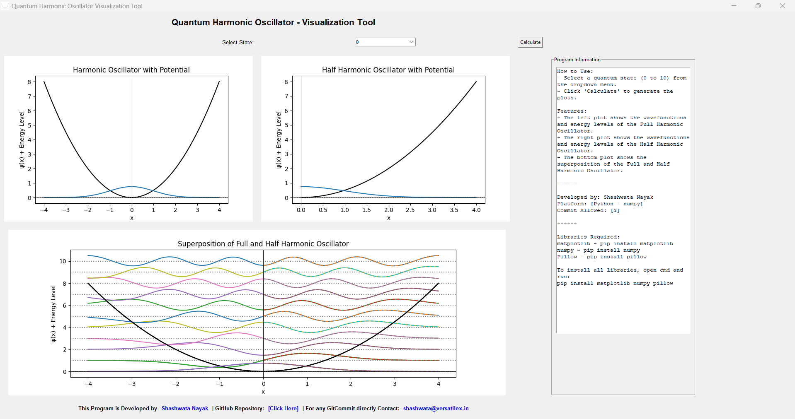

# Quantum Harmonic Oscillator Visualization Tool

A minimalist and efficient tool to visualize the energy levels and wavefunctions of the **Quantum Harmonic Oscillator** and **Half Harmonic Oscillator** up to the 10th state. The tool includes a side-by-side comparison of the oscillators with an additional superposition plot for better visualization and analysis.

---

## Features

- **Visualize Full Harmonic Oscillator**:
  - Energy levels and wavefunctions for quantum states from 0 to 10.
- **Visualize Half Harmonic Oscillator**:
  - Energy levels and wavefunctions with boundaries restricted to one side.
- **Superposition Plot**:
  - Compare the Full and Half Harmonic Oscillator states in a single combined plot.
- **Interactive GUI**:
  - Select a specific state using a dropdown and dynamically update the plots.

---

## How to Use

1. Download the ZIP file from the repository and extract it to your desired location.

2. Install Required Libraries:
   ```bash
   pip install matplotlib numpy pillow
   ```

3. Run the Program:
   ```bash
   python harmonic_oscillator_visualization.py
   ```

4. Explore the GUI:
   - Select a quantum state (0 to 10) from the dropdown.
   - Click "Calculate" to update the plots.

---

## Libraries Required

- **Matplotlib** - `pip install matplotlib`
- **NumPy** - `pip install numpy`
- **Pillow** - `pip install pillow`

To install all libraries at once:
```bash
pip install matplotlib numpy pillow
```

---

## Program Overview

This tool provides a graphical representation of the energy levels and wavefunctions of the **Quantum Harmonic Oscillator**. It includes:

1. **Full Harmonic Oscillator**:
   - Symmetric wavefunctions across the potential well.
2. **Half Harmonic Oscillator**:
   - Wavefunctions restricted to one side of the potential well.
3. **Superposition Plot**:
   - Overlay of Full and Half Harmonic Oscillator wavefunctions for comparison.

The tool is designed to help users understand the behavior of quantum harmonic oscillators and their boundary conditions.

---

## How the GUI Works

- **Dropdown**:
  - Select a specific quantum state (e.g., 0 for ground state, 1 for the first excited state, etc.).
- **Calculate Button**:
  - Updates all plots dynamically based on the selected state.
- **Plots**:
  - **Left Plot**: Full Harmonic Oscillator wavefunctions and energy levels.
  - **Right Plot**: Half Harmonic Oscillator wavefunctions and energy levels.
  - **Bottom Plot**: Superposition of Full and Half Harmonic Oscillator wavefunctions.

---

## Example Output

Below is an example of the GUI interface and plots:



---

## Developed By

**Shashwata Nayak**  
- **GitHub Repository**: [Click Here](https://github.com/shashwatanayak/quantum-harmonic-oscillator-visualization)  
- **Contact**: [shashwata@versatilex.in](mailto:shashwata@versatilex.in)

---

## Future Enhancements

- Include support for arbitrary boundary conditions.
- Add functionality for visualizing higher quantum states.
- Implement additional quantum systems like the anharmonic oscillator.

---

Enjoy exploring the quantum world!

